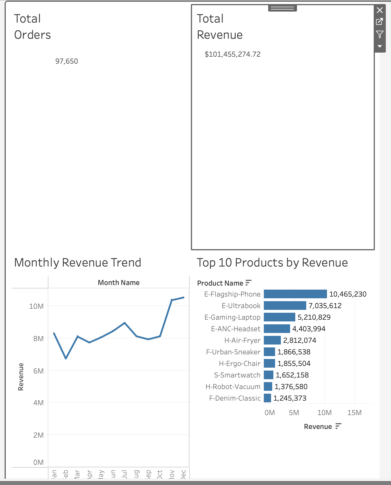

# Retail Sales Dashboard (Tableau)

## Overview
This project demonstrates an end-to-end data analysis workflow using a synthetic retail dataset.

## Key Metrics
- Total Revenue: $101M+
- Total Orders: 97,650
- Average Order Value (AOV): $1,038

## Dashboard Features
- Monthly Revenue Trend
- Top 10 Products by Revenue
- KPI Summary

## Tech Stack
- Python
- Tableau
- CSV

## Dashboard Preview

